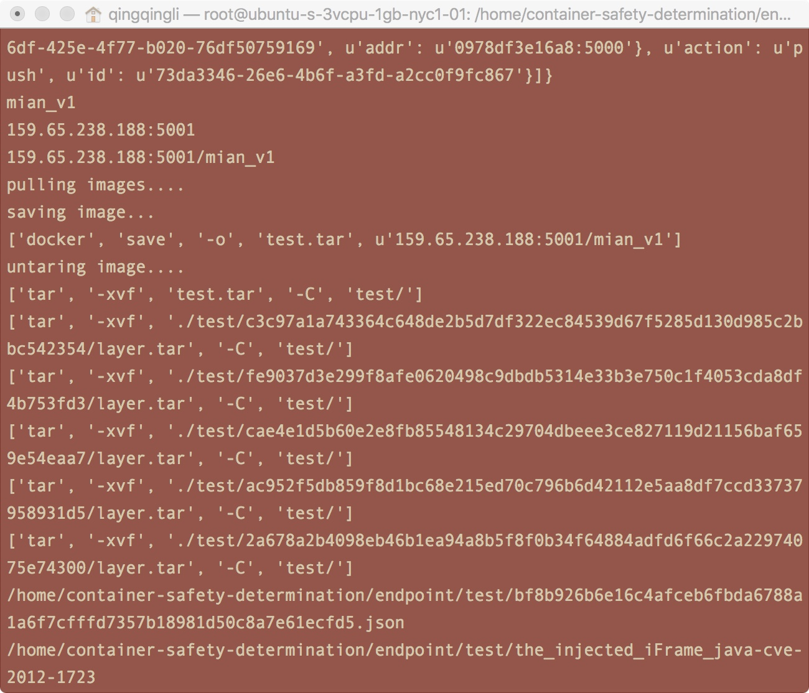
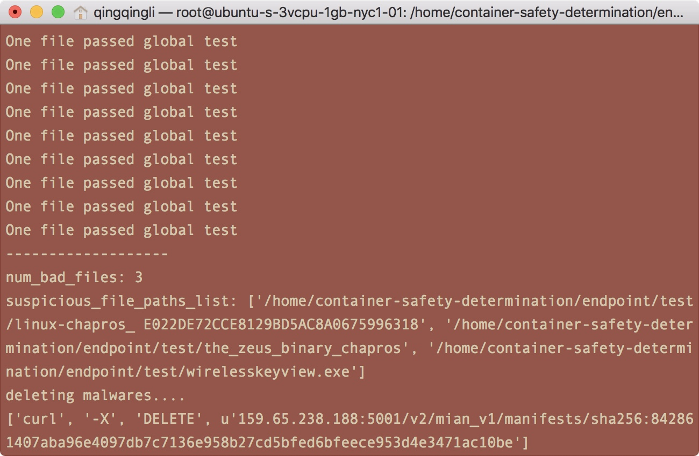
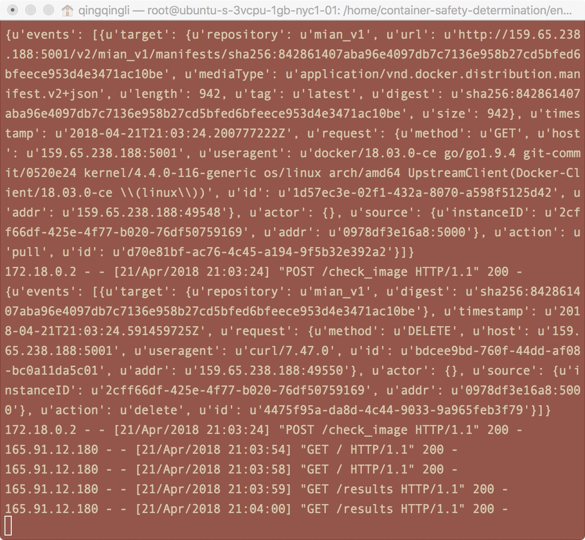
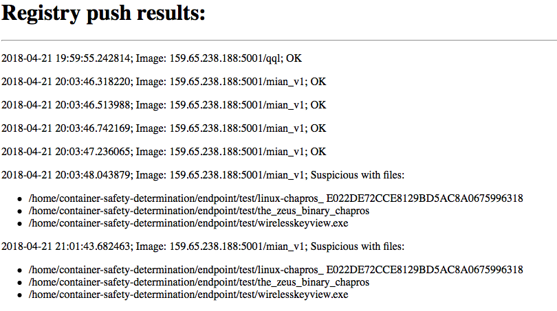
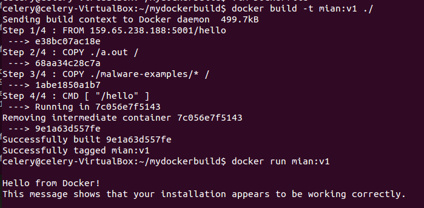
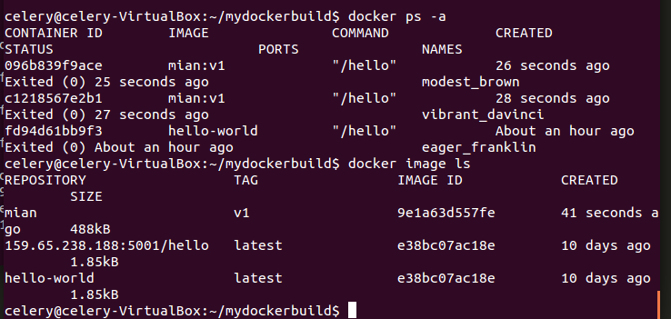
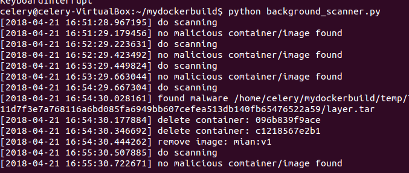
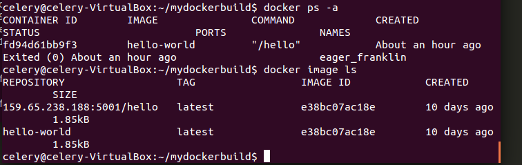

## Time efforts


We spent approximately 50 hours in total on this project.


## Project specification


Our project aims to provide a cloud service to verify the security for docker development, preventing malicious code compromising the infrastructures. The safety scan contains two parts, first, we will check the docker image uploaded by the developer in the private registry. Second, we will scan the running docker containers in the production development. Thus to make sure the security of the docker development and deployment.


## Background and motivation


Docker greatly simplifies the deployment and management of application. For example, to deploy an application consisting of a set of services one pulls corresponding docker images from a registry and wires them together. 


However, there are plenty of security vulnerability across the development stacks. During the development, the developers may pull images which contains malicious code or the developers themselves maybe compromised to intentionally inject malicious code to the application. Besides, during the deployment of docker containers in the production environment. The docker image may get attacked, for example due to the security vulnerability of the production environment.  In this project, we propose a solution to address these problems.


## Design


In this project, we propose to build a prototype software to demonstrate our approach. The software mainly contains three parts: 


1. A background crawler that pull the docker images that are pushed to the private registry. 
2. A docker image scanner to determine whether the image is malicious or not. To determine if the given images are malicious or not, we intend to compare the suspicious images with the Reference Data Set (RDS) collected by National Software Reference Library (NSRL). The RDS incorporates application hash values in the hashset which may be considered malicious, i.e. steganography tools and hacking scripts.
    - A local database can be used to cache those scanned files and thus to reduce the cost of scanning.
3. A background scanner to scan the running docker containers in the production environment. We intend to implement scanning scheduling, while use 3rd party tools for container scan.


The basic software we expect to implement contains the above docker image scan and docker container scan. Further, we may focus on the performance optimization for large scale system or we may consider more security vulnerabilities for docker development and deployment and implement approach to tackle them.


## Implementation


This is a service associated with a docker registry that can inspect pushed docker containers and figure out whether they are safe.


1. ClamAV is used to detect virus files.
2. sdhash values are calculated for each file for caching purpose.
3. MongoDB is used to store sdhashes, allow faster examination of previously checked files.
4. A registry application is running as a docker container. The virus checking happens every time we push an image into this registry.
5. Once we have a newly pushed image, the program will download and untar it into a local directory then do virus checking on all files there. 
6. If an image is detected as suspicious, the program will delete it in the registry.
7. The results can be shown in browser with the help of flask server.


## Prerequisite


### fuzzy_hash


#### Installation


`$ sudo python -m pip install fuzzyhashlib`


### MongoDB


#### Installation


run following command:


1. `$ sudo apt-get install -y mongodb-org`
2. `$ cd ~; mkdir data`
3. `$ echo 'mongod --bind_ip=$IP --dbpath=data --nojournal' > mongod`
4. `$ chmod a+x mongod`


#### Run service


Simply by `~/mongod`


#### Mongo shell


Run local Mongo shell by `mongo`
Connect a remote MongoDB: `mongo --host 34.233.78.56`


#### Install pymongo


Run `sudo python -m pip install pymongo`


#### Create db and collection


In mongo shell, create DB needed for this application.

- Create db: `use sdhash_db`
- Create collection: `db.createCollection("good_files")`


### Docker


#### Installation


Test on a Ubuntu 16.04 virtual machine.


<https://docs.docker.com/install/linux/docker-ce/ubuntu/>


Install `docker-compose` according to <https://docs.docker.com/compose/install/#install-compose>


#### Enable HTTP request


Add configuration file to the server host to connect to insecure private registry.  


```shell
$ sudo vim /etc/docker/daemon.json
```


Add below to the configuration file::  


```
{
"insecure-registries": ["REGISTRY_IP:REGISTRY_PORT"]
}
```


Restart docker daemon: 


```shell
$ sudo service docker stop
$ dockerd &
```


### ClamAV


#### Installation


```shell
$ sudo apt-get install clamav clamav-daemon
```


#### Run


1. Update clamAV DB: `sudo freshclam`
2. Start clamAV: `sudo service clamav-daemon start`


#### pyclamd


```shell
$ sudo pip install pyclamd
```


## Instructions on run the code


### Run the service


#### Start helper service


1. Start MongoDB: `$ ~/mongod`
2. Update clamAV DB: `$ sudo freshclam`
3. Start clamAV: `$ sudo service clamav-daemon start`


#### Specify IP and PORT


In `endpoint/constants.py`, specify following fields with respect to your server. Also change `notification:endpoint:url` field in `registry/config.yml` to be `http://REGISTRY_IP:WEB_PORT/check_image`.


- `REGISTRY_IP`
- `REGISTRY_PORT`
- `WEB_PORT`


#### Launch Registry


1. `$ cd registry/`
2. `$ docker-compose up`


#### Launch Endpoint


1. `$ cd endpoint`
2. `$ python endpoint.py`


### On client side


#### Docker build container


1. See [this link](https://docs.docker.com/engine/reference/builder/#escape)  
2. Use `COPY` to copy files in context directory to the new image.  
3. See the reference link for `RUN` and `CMD` command.  
4. Build with following command. Note the dot at the end, as context directory.


```shell
$ docker build -t your_container_name:version_tag .
```

#### Docker push container


##### Enable push to insecure registry  


Add configuration file to the server host to connect to insecure private registry.  


```shell
$ sudo vim /etc/docker/daemon.json
```


Add below to the configuration file:


```
{
"insecure-registries": ["REGISTRY_IP:REGISTRY_PORT"]
}
```


Restart docker daemon:


```shell
$ sudo service docker stop
$ dockerd &
```

Here is a [reference](https://github.com/docker/distribution/issues/1874).


##### Push to registry


```shell
$ docker tag image_name:tag REGISTRY_IP:REGISTRY_PORT/container_name
$ docker push REGISTRY_IP:REGISTRY_PORT/container_name
```


#### Docker save image


```shell
$ docker save -o a.tar container_name:version_tag
```


### View push results


Push results can be viewed through browser at `REGISTRY_IP:WEB_PORT/results`. Successful pushes are marked with OK. Failed pushes lists those suspicious files.


## Example


### Registry side


The endpoint is able to recognize the name, url of the images once a new image is pushed. Afterwards, the images are pulled and saved as compressed files as shown in Fig. {@fig:pull_save_tar}. Further, the safety check will examine the pushed images.


{#fig:pull_save_tar}


The Fig. {@fig:check_delete} above shows the logs coming from the safety check. It also prints out the number of bad files and the name of the suspicious files in the image. Once a suspicious image is detected, the endpoint implements deletion which removes the suspicious images from private registry.


{#fig:check_delete}


Fig. {@fig:pull_delete_json} show the printed JSON in the notification. It lists the two operations conducted on endpoint after a new image is pushed into the registry, one is pulling the image for safety check, another one following is the deletion once a malware is detected.


{#fig:pull_delete_json}


The results can be shown in a web page as Fig. {@fig:results}.


{#fig:results}


### Client side (production environment)


The client side or production environment side service provide a background scanner to check the running container regularly and kill/remove the malicious containers/images. The motivation here is when deploy the containers in the production environments, after pulling the image from our private registry, the image may be modified (build as new image in the client side) with malicious files and runs. The example here demonstrates how this is prevented by our background scanner.


First, on the production environment pull the non-malicious image **hello** and re-build with some malware file in the new image **mian:v1** as below.


{#fig:pull&build}


Then, we run two containers with the malicious image, see the images and running containers below.


{#fig:list_before}


Meanwile, we have already started our background scanner and here is the output of our backgrounder scanner. It will capture the malicious containers and delete the malicious container as well as the malicious images.

{#fig:scanner_result}


Finally, we list the containers and the images in the machine and we can see that the malicious containers and images are deleted. Only the safe containers are still exist.

{#fig:list_after}


## Conclusion


In this project, we learnt various basic operations on Docker, such as building images, extracting images, etc. Besides, we learn to manage and configure the private registry, including manipulating the endpoint and notifications in registry. Surprisingly, docker registry has limitation from the perspective of maximizing the waiting time for endpoint. Registry will constantly send notifications to endpoint as long as it doesn’t hear anything back from endpoint in a period of time, which is a short duration. It limits our safety check on relatively small images instead of large images, such as ubuntu. Because it takes a while for endpoint to respond to registry in order to check the safety of large images.


## Reference


- <https://okrieg.github.io/EC500/PROJECTS/2016/sastry.html>
- <https://www.nist.gov/software-quality-group/national-software-reference-library-nsrl>
- <http://roussev.net/sdhash/sdhash.html>

